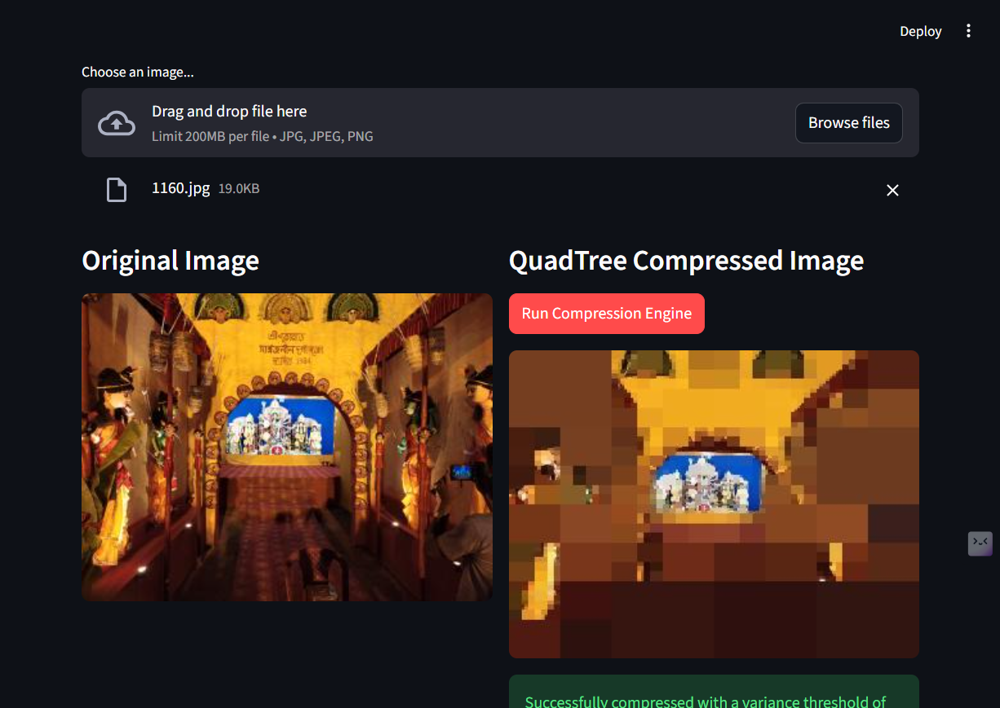

# 🌳 Spatial Image Compression Engine (QuadTree)

An asynchronous, full-stack microservice that applies spatial QuadTree algorithms to perform dynamic, lossy image compression based on RGB color variance.

## 🚀 Architecture
This project is built using a decoupled microservice architecture to separate CPU-bound mathematical processing from the user interface.
* **Backend:** FastAPI (Python) handles the heavy algorithmic processing, utilizing `numpy` for high-speed tensor and matrix calculations to determine spatial color variance.
* **Frontend:** Streamlit provides a reactive, real-time user interface, communicating with the backend via RESTful API endpoints.
* **Core Algorithm:** Custom-built QuadTree data structure that recursively subdivides images based on Mean Squared Error (MSE) of RGB pixels, generating abstract, mathematically optimized "pixel-art" style compressions.

## 🛠️ Tech Stack
* **Language:** Python 3
* **API Framework:** FastAPI, Uvicorn
* **Math & Image Processing:** Numpy, Pillow (PIL)
* **Frontend:** Streamlit

## ⚙️ How to Run Locally
1. Clone the repository.
2. Install the requirements: `pip install -r requirements.txt`
3. Start the FastAPI backend: `uvicorn quadtree_api.main:app --reload`
4. Start the Streamlit frontend: `streamlit run quadtree_api/app.py`